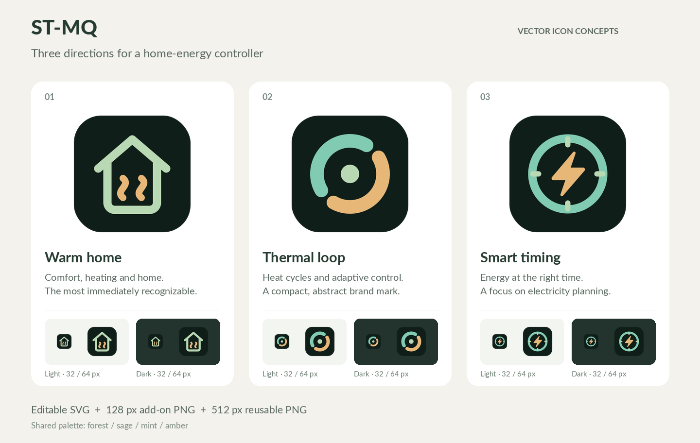

# ST-MQ icon concepts

Three original vector proposals using the dashboard's forest, sage, mint and
amber palette. **Warm home** is the recommended starting point: it communicates
home heating immediately. **Thermal loop** is the more abstract branding option;
**Smart timing** emphasizes electricity planning.



| Concept | Editable vector | Add-on PNG | Larger PNG |
| --- | --- | --- | --- |
| 01 · Warm home | [SVG](01-warm-home.svg) | [128 × 128](01-warm-home-128.png) | [512 × 512](01-warm-home-512.png) |
| 02 · Thermal loop | [SVG](02-thermal-loop.svg) | [128 × 128](02-thermal-loop-128.png) | [512 × 512](02-thermal-loop-512.png) |
| 03 · Smart timing | [SVG](03-smart-timing.svg) | [128 × 128](03-smart-timing-128.png) | [512 × 512](03-smart-timing-512.png) |

The SVGs scale to any resolution and contain only vector shapes, with no fonts,
embedded bitmaps or external assets. Each includes a forest green rounded badge
with transparent outer corners. For a symbol without the badge, remove the first
`rect` element. The artwork follows the project's MIT license.

These are proposals; no root add-on icon has been selected. To use one, copy its
128 px PNG to `icon.png` in the repository root, beside `config.json`.
Home Assistant requires a square PNG named `icon.png` and recommends 128 × 128 px;
see the [official presentation guide](https://developers.home-assistant.io/docs/apps/presentation/#app-icon--logo).

To revise a design, edit its SVG in a vector editor and export at 128 px and
512 px. The supplied exports were rendered with CairoSVG 2.8.2, for example:

```sh
cairosvg 01-warm-home.svg -o 01-warm-home-128.png --output-width 128 --output-height 128
cairosvg 01-warm-home.svg -o 01-warm-home-512.png --output-width 512 --output-height 512
```

Run those commands from this directory with CairoSVG installed. It is only an
artwork export tool, not an application dependency. Update the comparison image
after changing the artwork; its small samples show 32 px and 64 px rendering on
light and dark backgrounds.
