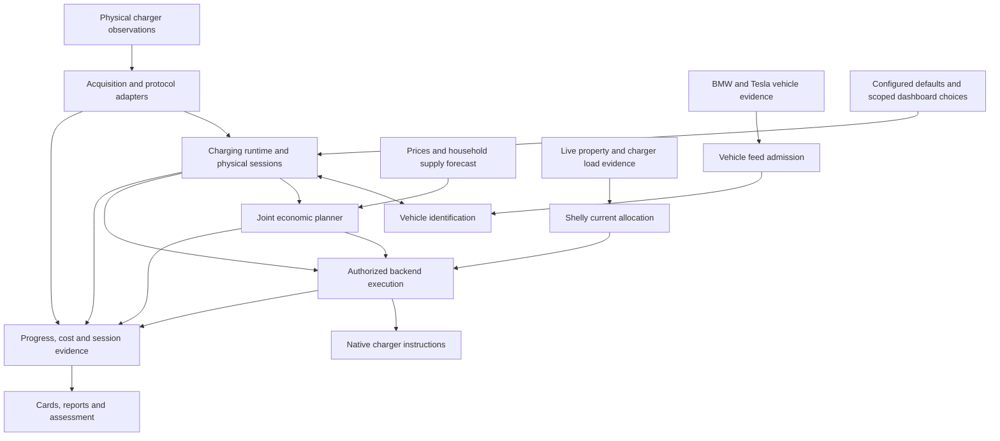

# Charging architecture and code map

[Charging overview](../charging.md) · [Policies](policies.md)

Charging combines a shared session model with three execution backends. It is
organized by responsibility, with a coordinating runtime; it is not one isolated
application per charger and not a strict identification-then-planning pipeline.
Unidentified vehicles can have plans, passive identification can run while
Automatic is off, and load adjustment can run during Charge now.

## Responsibilities and flow

The arrows indicate information and command relationships, not a promise that
one stage's success establishes the next. Execution rechecks current authority,
connection and native evidence. Reports consume proposed plans, confirmed
instructions and physical observations as distinct records. Assessment inputs
have no edge into the production planner or actuators.

## Where to find the implementation

Paths are relative to the repository root. Companion files belong to the same
area; they are not separate public APIs.

| Area and question | Main implementation | Detailed contract |
| --- | --- | --- |
| Runtime: what connects the current session and subsystem decisions? | [`src/charging/runtime.js`](../../src/charging/runtime.js) | This map and [execution](execution-and-recovery.md) |
| Model and requests: what belongs to equipment, configuration or this connection? | [`model.js`](../../src/charging/model.js), [`settings.js`](../../src/charging/settings.js), [`config.js`](../../src/charging/config.js), [`soc.js`](../../src/charging/soc.js), [`target.js`](../../src/charging/target.js) | [Policies](policies.md#who-owns-each-value), [configuration](../configuration.md#charging-defaults-and-dashboard-overrides) |
| Identification: which vehicle does the positive evidence support? | [`identification.js`](../../src/charging/identification.js), [`vehicle.js`](../../src/charging/vehicle.js), [`identity-evidence.js`](../../src/charging/identity-evidence.js), [`joint-identification.js`](../../src/charging/joint-identification.js) | [Identification](identification.md) |
| Vehicle acquisition: what did each vehicle source actually report? | [`teslamate.js`](../../src/charging/teslamate.js), [`vehicle.js`](../../src/charging/vehicle.js), [`BMW publisher`](../../scripts/lib/bmw-cardata-automation.js) | [TeslaMate](integrations/teslamate.md), [BMW](integrations/bmw.md) |
| Economic planning: when can the requests be served at low cost? | [`planner.js`](../../src/charging/planner.js), [`planner-input.js`](../../src/charging/planner-input.js), [`plan-inputs.js`](../../src/charging/plan-inputs.js), [`planner-service.js`](../../src/charging/planner-service.js), [`planner-worker.js`](../../src/charging/planner-worker.js) | [Planning](planning.md) |
| Supply forecast: what household demand and capacity are expected? | [`history.js`](../../src/charging/history.js), [`history-reference.js`](../../src/charging/history-reference.js), [`history-service.js`](../../src/charging/history-service.js), [`history-worker.js`](../../src/charging/history-worker.js), [`supply.js`](../../src/charging/supply.js) | [Planning](planning.md#joint-allocation-and-execution) |
| Live allocation: what current is justified now? | [`shelly-limit.js`](../../src/charging/shelly-limit.js), controller integration in [`shelly-evse.js`](../../src/charging/shelly-evse.js) | [Current allocation](current-allocation.md) |
| Easee cloud execution: what schedule is owned and confirmed? | [`controller.js`](../../src/charging/controller.js), [`easee.js`](../../src/charging/easee.js) | [Easee cloud](integrations/easee.md) |
| Local OCPP: what transaction/profile can be controlled? | [`src/charging/ocpp.js`](../../src/charging/ocpp.js), [`src/acquisition/easee-ocpp.js`](../../src/acquisition/easee-ocpp.js), [`easee-ocpp-setup.js`](../../src/acquisition/easee-ocpp-setup.js) | [Easee OCPP](integrations/easee.md#direct-local-ocpp-telemetry-firmware-344-or-later) |
| Shelly protocol/execution: what roles, permission and settings are supported? | [`shelly-evse.js`](../../src/charging/shelly-evse.js), [`shelly-profile.js`](../../src/charging/shelly-profile.js), [`shelly-system-permission.js`](../../src/charging/shelly-system-permission.js) | [Shelly](integrations/shelly.md), [system exception](execution-and-recovery.md#shelly-system-permission-changes) |
| Transport and source admission: which observations are current and usable? | [`src/acquisition/`](../../src/acquisition/), including MQTT admission/reception, Easee streams and [`devices.js`](../../src/acquisition/devices.js); [`stream-evidence.js`](../../src/charging/stream-evidence.js) preserves identification connection transitions | Integration guides and [recording](../recording.md) |
| Progress and cost: what energy is recorded and what battery charge is estimated? | [`energy.js`](../../src/charging/energy.js), [`progress.js`](../../src/charging/progress.js), [`session-cost.js`](../../src/charging/session-cost.js), [`rates.js`](../../src/charging/rates.js), shared storage | [Evidence](evidence-and-reporting.md) |
| Reports and assessments: what was observed and what remains untested? | [`session-diagnostics.js`](../../src/charging/session-diagnostics.js), [`physical-tests.js`](../../src/charging/physical-tests.js), [`shared-assessment.js`](../../src/charging/shared-assessment.js), [`allowance-history.js`](../../src/charging/allowance-history.js) | [Reports](evidence-and-reporting.md), [guided assessments](guided-assessments.md) |
| Setup and informational metadata: what is configured, discovered or missing? | [`setup.js`](../../src/charging/setup.js), [`device-info.js`](../../src/charging/device-info.js), acquisition setup status | [Setup in the user guide](user-guide.md#device-information-and-setup) |
| Dashboard and server API: how are those distinctions presented and edited? | [`chart/charging.js`](../../chart/charging.js), [`charging-setup.js`](../../chart/charging-setup.js), [`charging-tests.js`](../../chart/charging-tests.js), [`charging-diagnostics.js`](../../chart/charging-diagnostics.js), [`charging-report-history.js`](../../chart/charging-report-history.js), [`src/app/server.js`](../../src/app/server.js) | [User guide](user-guide.md) |
| Optional physical development: what independently recorded evidence supports a selected case? | [`scripts/charging-physical/`](../../scripts/charging-physical/) and focused tests in [`test/`](../../test/) | [Testing](testing.md) |

`controller.js` is specifically the Easee cloud controller. `shelly-evse.js`
contains both protocol adapter and controller behavior. `runtime.js` contains
coordination and some identification orchestration; the responsibilities above
are not completely isolated modules. `physical-tests.js` is the durable guided
observer, with no actuator; the optional CLI observers are separate tools.

## State has several independent lifetimes

| Scope | Examples | Boundary |
| --- | --- | --- |
| Physical equipment | Automatic preference, shared priority, native setup ownership | Configured equipment identity |
| Physical connection | Request, deadline, vehicle assignment, energy/cost | Confirmed connection and disconnect evidence |
| Identification attempt | Consumed budget, current comparison, pause, historical match evidence | Attempt identity and absolute deadlines |
| Execution intention | Pending dispatch, confirmed native instruction, uncertainty | Equipment, connection, revisions and native source evidence |
| Acquisition connection | MQTT/OCPP generation, synchronized stream state, metadata availability | Transport reconnect and fresh admission |
| Historical record | Original observations, report events, selected assessment | Recorded provenance and explicit retention policy |

Restart may restore durable scope; it never turns saved observations into new
physical evidence. The detailed contracts specify the fresh checks needed before
using restored state. Report history, session overrides and restoration duties
are separate records; deleting a report does not erase an equipment obligation.

## Admitted transitions and read-only projections

Vehicle/source admission, native reconciliation and planning-state refresh own
runtime transitions inside the storage write scope. They advance connection
requests, simultaneous vehicle assignments, consumed evidence, identification
attempts, source-derived target state and request defaults. Native reconciliation
admits these changes even when Automatic is off. An accepted Tesla observation
updates its capture and runtime context in the same acquisition transaction;
buffered subscription replay isolates each observation with a savepoint so a
caught failure cannot commit only one side. Failed buffered replay or its outer
commit withholds source readiness until a fresh successful subscription; BMW
subscription replay follows the same savepoint and readiness boundary. An
overflowed subscription buffer also requires a fresh successful subscription;
dropping older boundaries cannot establish a healthy partial replay.
Existing original source clocks and physical obligations retain their meaning.

Ordinary vehicle MQTT receipts also withhold source availability while queued or
after failed admission. Tesla topics and independently reported BMW fields keep
their own failure outcomes: unrelated, retained or duplicate packets cannot
restore failed evidence. A fresh accepted report for the affected evidence must
commit before availability returns. Source-clock quarantine follows the same
admission outcome. The synchronous owning transition can evaluate its candidate
observation, while other pending or failed receipts remain unavailable. Failed
postcommit observers do not roll back or invalidate committed source evidence.
Accepted source transitions save usable battery references in the same runtime
write; retaining them adds no recorded-energy queries.

Admission health belongs to the relevant vehicle's planning basis. A cached plan
cannot retain its earlier evidence assumptions after source admission fails. A
pending or failed receipt also cancels already selected native work before dispatch;
ordinary synchronously accepted traffic does not repeatedly cancel that work. A
new calculation may use labelled same-connection references under the existing
planning policy. Other vehicle sources, native restoration and fallback retain
their own evidence and authority checks.

`telemetry()`, `views()` and `status()` project accepted context and current
availability. Polling cannot create session requests or attempt IDs, consume
source evidence, renew deadlines, expire a manual SOC anchor or write storage.
A newly observed replacement/disconnect immediately withholds the old identity
and actionable request until the admitted transition completes; it does not
silently clear durable context. Returned projections do not expose writable
references to requests, observations, plans or configured defaults. Diagnostics
consume these same projections without becoming an additional transition owner.

Runtime and Easee ownership serializers validate the candidate current durable
shape before saving, using the same validators as restart. Failure before COMMIT
keeps previous committed state and rolls back the owning transition. A failure
in a postcommit observer retains the new committed state and reports the error;
it cannot restore older state or automatically dispatch a command. These checks do
not replace protocol admission, live authority or native command confirmation.

## Two example sequences

**New connection with Automatic enabled.** Fresh physical evidence starts the
session and fixes ready-by. Configuration/session inputs allow planning before
identity is known. The current native instruction is inspected before permitted
automatic takeover. Identification may observe normal charging or use its bounded
action. Later identity supplies applicable vehicle inputs without resetting the
connection's deadline, cost or energy. Proposed changes are not shown as confirmed
execution until native readback establishes them.

**Native Stop during identification.** The independent instruction constrains
execution immediately when positively observed. A pending/temporary setting keeps
its restoration obligation and original deadline. Restoring a higher current
requires the applicable confirmed stop and fresh physical zero; a saved attempt
cannot authorize Start over a native hold. The report records instruction,
readback, draw and gaps separately. A subsequent Charge now request is not proof
that an uncertain earlier command has been resolved.

## Failure boundaries

| Missing or interrupted evidence | Consequence |
| --- | --- |
| BMW/Tesla feed | Withdraw unusable automatic values and identity certainty as applicable; continue planning from valid session/default inputs. Same-connection last-known charge has an explicit scope. |
| Shared price/capacity forecast | Follow the adopted-instruction preservation and provisional-release rules; missing current alone uses the planning assumption. |
| Live property/charger evidence | Select bounded Shelly fallback under known tighter limits when usable source evidence is lost; unchanged values confirmed by healthy current reporting remain usable. Equalizer allowance and native-budget evidence do not gate Shelly's calculation. |
| Charger communication | Commands/readback cannot be claimed; retain uncertainty and restoration. Software cannot deliver a fallback over a broken link. |
| Application stop or handover | Preserve native instructions and OCPP configuration; reconcile saved scope with fresh evidence after recovery. |
| Report storage | Surface the failure while ordinary control and restoration remain available. |

See [execution and recovery](execution-and-recovery.md), [current allocation](current-allocation.md)
and the integration qualification sections for the precise boundaries and
physical limitations. [Testing](testing.md) maps software checks, passive
assessment and manually operated hardware work to the claims each can support.

## Charging persistence

Charging runtime format 7 uses a small manifest at `charging:<input>` and
independent state rows under `charging:<input>:runtime:`. Control intent, source
receipts, session evidence and view fields change independently. Every publication
commits its changed rows, manifest and removal of superseded references in one
normal Store transaction. The shared journal and its durability policy are
unchanged. Automatic choices, physical session/equipment scope, pending ownership
and restoration remain authoritative only under their existing live evidence gates.

Plans are immutable content-addressed records, shared by the internal charger
state and recorded view. Scenario arrays and interval reference context are
separate complete immutable records, referenced by the plan. Readers restore the
exact values and original clocks; they do not recalculate a historical plan.
Only currently referenced runtime plans/contexts remain in this namespace.
Report-owned historical contexts retain their independent report lifetime.
There are no chained deltas, alternate old-format readers or migration paths.

Completed and active report bodies are read from the report tables at the same
committed replica publication. Runtime state retains only report retention and
observer availability/error metadata. The report reader uses the publication's
source clock and preserves the last committed assessment's observed/evaluated
clocks, rather than piggybacking unsaved observer timestamps into runtime writes.
No viewer clock advances a recorded assessment or supplies control authority.

Startup validates the current manifest, every required field, content hashes and
references for all input environments, including inactive ones. Missing records,
unreferenced fragments, invalid nested state and older aggregate formats fail
before writable setup. Schema 29 requires an intentional fresh development start;
opening an incompatible installation never resets or converts it.

Rollback restores both persisted state and observer bookkeeping, including report
save cadence, guided assessments and allowance-history row references. A failed
publication cannot suppress report events or point the next allowance extension
at a row that rolled back. A same-version restart hydrates the current state and
then requires fresh device evidence under the existing execution contract.

`test/charging-runtime-storage.test.js` covers unchanged large plans with changing
source clocks, journal bytes, atomic replacement/cleanup, failed publication,
pinned readers and invalid-fragment preflight. These offline fixtures establish
representation and recovery behavior, not physical HA write throughput or latency.
